# CANDIL
CANDIL (Context-Aware Network Data Integration Loom) is a semantic monitoring framework for integrating data from heterogeneous network sources. This work is a fork of a previous [open-source SDA repository](https://github.com/giros-dit/semantic-data-aggregator).

## CANDIL Ontology

### Purpose and Scope

The CANDIL Ontology

The CANDIL Ontology is divided into 2 modules:

- Topology module: [https://w3id.org/candil/topology](https://w3id.org/candil/topology)
- Interface module: [https://w3id.org/candil/interface](https://w3id.org/candil/interface)

### Vocabulary Development

This ontology is developed following the guidelines of the [LOT methodology](https://lot.linkeddata.es).

#### Requirements

The requirements of this ontology are written as tabular format, which have been captured in folder [requirements](./requirements).

#### Ontology Model

The following diagrams shows the classes and properties defined in the ontology. The diagram follows the [Chowlk notation](https://chowlk.linkeddata.es/notation.html).



#### Ontology Code (OWL)

The OWL code of the ontology modules, serialized in Turtle format, is available [here](./ontology/).

#### Examples

Sample RDF datasets are provided in the [examples folder](./examples/).

#### Evaluation

This ontology is evaluated using the following tools:
- [OOPS](https://oops.linkeddata.es)
- [FOOPS](https://foops.linkeddata.es/FAIR_validator.html)
- SPARQL queries

The evaluation reports from OOPS and FOOPS, along with the SPARQL queries, are available in the [evaluation folder](./evaluation/).

#### Documentation

The ontology documentation was generated using the WIDOCO tool.

We encourage to locally develop the ontology documentation before publishing it online. For this, we recommend running WIDOCO tool via Docker container.

To generate the documentation, execute the following command:

```bash
./generate-docs.sh
```

## CANDIL KG

The CANDIL KG mechanisms and related artifacts can be found in folder [candil-kg](./candil-kg/).

### Morph-KGC Guidelines

Build the image as follows:

```bash
cd morph-kgc
docker build -t morph-kgc --build-arg optional_dependencies="sqlite kafka" .
```

Then run the container like this:

```bash
cd ..
docker run -it -v ./mappings/containerlab/:/files morph-kgc-new /files/config.ini
```

## Acknowledgements

This work has been partly supported by project [ECTICS](https://www.dit.upm.es/~giros/project/ectics/) (PID2019-105257RB-C21), funded by:


